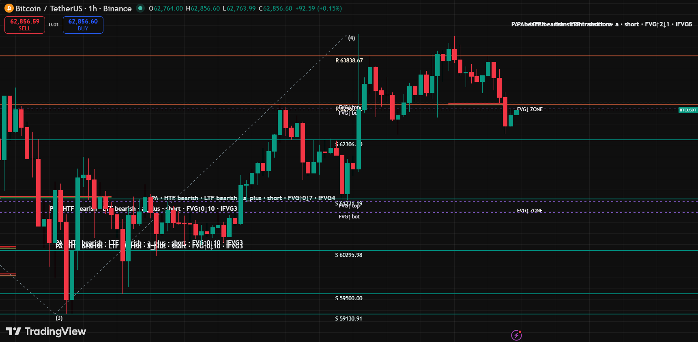
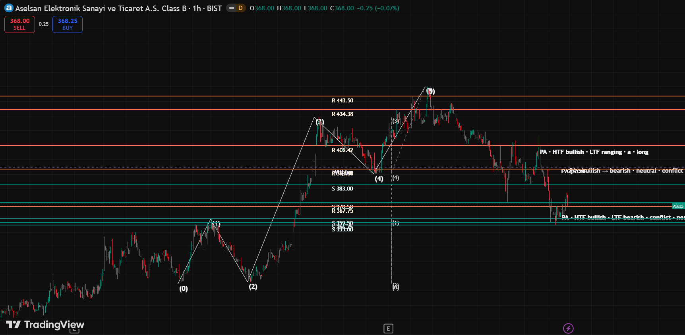

# BIST Trader MCP

[](https://github.com/Enesp4rl4k/bist-trader-mcp)
[](LICENSE)
[](https://www.python.org/)

**Open-source MCP server** for Turkish markets **and** crypto: macro & market data, **fundamental research routing** (KAP, BIST, VIOP, EVDS, crypto), **rule-based technical analysis** (Price Action, range/FVG, Elliott MTF), and **TradingView Desktop** drawing via CDP (Long/Short position tool).

> **Open beta (v0.4.0):** `run_market_assistant` + **fusion** layer merges live fundamentals with PA/EW gates before drawing a position.

> **Trade assistant, not a profit bot.** No broker execution. Not investment advice.

| | |
|---|---|
| **One MCP in Cursor** | `bist-trader` only — TV bridge built-in (`TRADINGVIEW_MCP_PATH`) |
| **Markets** | BIST equities · BIST indices · VIOP · Crypto (Binance symbols) |
| **Main flow** | **`run_market_assistant`** → KAP/funding + PA/EW + `chat_report` + TradingView |

## Screenshots

Each demo chart shows **three layers** (PA is the sizing engine; Elliott is the scenario overlay):

| Layer | On chart |
|-------|----------|
| **Price Action** | Horizontal **PA S / PA R** levels + `PA HTF … / LTF …` structure banner |
| **Elliott Wave** | Scenario layer in MCP (chart lines optional; demos emphasize PA + position tool) |
| **Trade plan** | TradingView **Long/Short position** box (entry/stop/TP from PA `recommended_setup`) |

**Crypto — BINANCE:BTCUSDT:**



**BIST — ASELS:**



Regenerate after `launch_tv_debug.bat`: `python scripts/capture_linkedin_screenshots.py` — see [`docs/images/README.md`](docs/images/README.md).

## Quick start (trade assistant)

```powershell
# 1) TradingView Desktop — CDP port 9222
C:\path\to\tradingview-mcp\scripts\launch_tv_debug.bat

# 2) Cursor MCP — .cursor/mcp.json
{
  "mcpServers": {
    "bist-trader": {
      "command": ".venv\\Scripts\\python.exe",
      "args": ["-m", "bist_trader_mcp"],
      "env": { "TRADINGVIEW_MCP_PATH": "C:\\path\\to\\tradingview-mcp" }
    }
  }
}

# 3) In chat (timeframes optional — auto from market profile)
run_market_assistant(symbol="ASELS")            # BIST — chat_report + TV chart
run_market_assistant(symbol="BINANCE:BTCUSDT")
run_scenario_assistant(symbol="F_XU0300625", market="viop")  # alias
get_market_profile(symbol="THYAO")
get_kap_disclosures(company="THYAO")            # fundamental layer (after checklist)
```

| Market | Example symbol | Default HTF → LTF |
|--------|----------------|-------------------|
| Crypto | `BINANCE:BTCUSDT` | 4H → 1H |
| BIST equity | `THYAO`, `ASELS` | Daily → 1H |
| BIST index | `XU030` | Daily → 1H |
| VIOP future | `F_XU0300625` | 4H → 15m |

## Documentation

| Document | Description |
|-------|----------|
| [**Trade Assistant**](docs/TRADE_ASSISTANT.md) | `run_market_assistant`, chat, parameters |
| [**Analysis pipeline**](docs/ANALYSIS_PIPELINE.md) | Data quality, PA/EW, fusion gates |
| [**Performance & consistency**](docs/PERFORMANCE_AND_CONSISTENCY.md) | Speed, single account, tests |
| [**PA checklist**](docs/PA_CHECKLIST_TR.md) | Technical checklist |
| [All documents](docs/README.md) | Index |

**LinkedIn (EN):** [`docs/LINKEDIN_POST.md`](docs/LINKEDIN_POST.md) · **Plan:** [`docs/MASTER_PLAN_TRADE_ASSISTANT.md`](docs/MASTER_PLAN_TRADE_ASSISTANT.md)

### Trade Assistant tools (v0.4)

| Tool | Role |
|------|-----|
| `run_market_assistant` | Single entry: TV OHLCV → TA → fundamental → fusion → chat → draw |
| `analyze_market_context` | Without TV: TA + fundamental checklist |
| `analyze_chart_scenarios` | Technical package only |
| `design_scenario_trade_plan` | Plan + playbook (requires OHLCV) |
| `get_market_profile` | HTF/LTF and thresholds |

---

## Overview

MCP server for Turkish financial markets and global assets. Combines public data sources (CBRT EVDS, KAP, BIST EOD, VIOP, MKK) into a single LLM tool surface; supports **Pine v6 recipes** and TradingView CDP drawing.

> *Gather financial data → Analyze with Claude → Scenario + position box on TradingView.*


## Layers

| Layer | Release note | Focus |
|--------|------------|------|
| **Trade Assistant** | **v0.4.0** (top of this README) | PA + EW + fusion + TV + `chat_report` |
| **Quant / macro MCP** | v0.4–v0.8 tools | EVDS, VIOP, backtest, Markowitz, Kelly, … |

### Quant toolkit (v0.8 highlights)

> **backtester**, **performance metrics** (Sharpe/Sortino/Calmar/MaxDD), **Markowitz optimizer**, **Kelly + ATR sizing** — signal → backtest → optimize → position sizing.
> **v0.7**: **volatility forecasting** (EWMA + GARCH(1,1)), **BIST sector rotation** analysis, **on-chain** (Etherscan gas + BTC network), **Nelson-Siegel-Svensson yield curve fitter**.
> **v0.6**: **options strategy simulator** (straddle, strangle, iron condor, butterfly, vertical), **realized volatility** (CC + Parkinson + Garman-Klass + IV/RV ratio), and **financial news/RSS aggregator**.
> **v0.5**: crypto options IV surface (Deribit), crypto F&G sentiment, and **multi-asset correlation analytics**.
> **v0.4 evolved into a global trader MCP**: Added **crypto (CoinGecko + Binance perp funding/OI)**, **global spot FX (ECB reference rates)**, **global indices/treasuries/commodities snapshot**, and **standard technical indicators (RSI/MACD/Bollinger/ATR/EMA/SMA)** to the TR-focused core.

**Status labels:**
- [LIVE] — verified with real data, prod-grade
- [KEY] — CBRT EVDS key required; works
- [WIP] — upstream endpoint behind WAF/captcha/HTML, will connect via browser-automation in v0.3.

### Rates / Treasury / CBRT
- [KEY] `get_yield_curve` — Government bond benchmark curve (1M-10Y), CBRT EVDS
- [KEY] `get_tcmb_policy_rates` — 1w repo + corridor time series
- [LIVE] `get_dibs_auctions` — Treasury auction calendar (quarterly PDF → pdfplumber → 22+ scheduled auctions)
- [LIVE] `calculate_bond_metrics` — YTM, modified duration, convexity
- [KEY] `list_catalog` — utilized EVDS series

### Disclosure / equity
- [LIVE] `get_kap_disclosures` — KAP notification list (Playwright-backed, heuristic material filter)
- [LIVE] `get_bist_eod_ohlcv` — BIST equity/index daily OHLCV (Yahoo Finance v8 chart API)
- [LIVE] `get_mkk_market_stats` — MKK marketwide monthly time series (PDF + pdfplumber)
- [WIP] `get_foreign_ownership` — MKK **per-ticker** foreign ownership ratio (gated portal, v0.3)

### Derivatives — VIOP & Takasbank
- [LIVE] `get_viop_dashboard` — **marketwide margin call + volume + OI** snapshot from Takasbank (Playwright + stealth)
- [LIVE] `get_viop_settlement` — **live per-contract snapshot** (last price, % change, volume TL, OI) for all 480+ VIOP futures + options.
- [LIVE] `get_viop_term_structure` — futures term structure (contango / backwardation)
- [WIP] `get_viop_margin_parameters` — per-contract SPAN parameters (v0.4)
- [WIP] `get_viop_margin_call_alerts` — per-contract margin ratio changing by 5%+ (v0.4)
- [LIVE] `calculate_option_greeks` — Black-Scholes Δ Γ Θ Vega ρ (TR-distressed IV brackets)
- [LIVE] `calculate_implied_volatility` — IV solver from market price

### Cross-asset
- [LIVE] `calculate_basis_fair_value` — futures vs spot cost-of-carry deviation + implied repo

### Derivative analytics (v0.3 new)
- [LIVE] `get_viop_iv_surface` — VIOP options implied vol surface: per-strike IV/Δ/moneyness, ATM term structure, 25Δ skew.
- [LIVE] `find_viop_spread_opportunities` — calendar / vertical / butterfly spread scanner
- [LIVE] `calculate_portfolio_var` — parametric / historical VaR + Expected Shortfall, gamma adjustment
- [LIVE] `stress_test_portfolio` — built-in scenarios (rates+200bp, tl_devalue_20pct, xu030_-10pct, vol_spike, broad ±5%) + custom scenario

### Observability (v0.3 new)
- [LIVE] `get_health_status` — cache freshness + Playwright + EVDS key status

### Global markets (v0.4 new)
- [LIVE] `get_global_pulse` — global summary in one call: SPX/NDX/DAX/FTSE/N225/HSI + UST 3M/5Y/10Y/30Y + WTI/Brent/Gold/Silver/Copper/Natgas + BTC/ETH/SOL
- [LIVE] `get_global_fx_spot` — ECB reference rates (EURUSD, USDJPY, GBPUSD, ...)
- [LIVE] `get_global_fx_history` — daily FX history
- [LIVE] `get_global_fx_matrix` — G10 bases × EM quotes matrix

### Crypto (v0.4 new)
- [LIVE] `get_crypto_spots` — CoinGecko spot snapshot (top N coins)
- [LIVE] `get_crypto_klines` — Binance spot OHLCV (1m–1w, max 1000 bars)
- [LIVE] `get_crypto_funding_rates` — Binance USD-M perp funding history + annualised avg
- [LIVE] `get_crypto_open_interest` — perp OI history

### Technical indicators (v0.4 new)
- [LIVE] `calculate_technicals` — for any OHLCV series: SMA 20/50/200, EMA 12/26, RSI(14), MACD(12/26/9), Bollinger(20,2σ), ATR(14) + categorical labels

### Crypto options & sentiment (v0.5 new)
- [LIVE] `get_deribit_iv_surface` — BTC/ETH option IV surface (Deribit mark_iv)
- [LIVE] `get_crypto_fear_greed` — alternative.me composite F&G index + history

### Multi-asset correlation (v0.5 new)
- [LIVE] `calculate_correlation_matrix` — N×N pairwise correlation + top-10 |ρ| + bottom-10
- [LIVE] `calculate_rolling_correlation` — rolling correlation for two series

### Options strategy simulator (v0.6 new)
- [LIVE] `simulate_option_strategy` — full P&L grid, max profit/loss, breakevens, net debit/credit for straddle/strangle/iron condor/butterfly/vertical spreads.
- [LIVE] `list_strategy_templates` — list of available templates

### Realized volatility (v0.6 new)
- [LIVE] `calculate_realized_vol` — close-to-close + Parkinson (H/L) + Garman-Klass (O/H/L/C)

### Financial news (v0.6 new)
- [LIVE] `get_news_headlines` — RSS aggregator: Investing.com, Yahoo Finance, Reuters business, CoinDesk.

### Volatility forecasting (v0.7 new)
- [LIVE] `calculate_ewma_volatility` — RiskMetrics EWMA (λ=0.94), vol path + next-period forecast
- [LIVE] `calculate_garch_forecast` — GARCH(1,1) coarse-grid MLE + horizon path + stationary long-run vol

### BIST sector rotation (v0.7 new)
- [LIVE] `get_bist_sector_rotation` — total return, recent return, relative strength vs XU100 for 17 sector indices.

### On-chain (v0.7 new)
- [LIVE] `get_eth_gas_oracle` — Etherscan: safe/propose/fast gas (Gwei) + suggested base fee
- [LIVE] `get_btc_network_stats` — blockchain.info: hashrate, difficulty, supply, mempool

### Yield curve fitting (v0.7 new)
- [LIVE] `fit_yield_curve_nss` — Nelson-Siegel or NSS fit; yield interpolation for any tenor

### Backtest + performance (v0.8 new)
- [LIVE] `backtest_strategy` — event-driven backtest: closes + signals → equity curve + trades + full performance panel.
- [LIVE] `list_signal_generators` — available signal generators
- [LIVE] `calculate_performance_panel` — Sharpe, Sortino, Calmar, max drawdown, win rate, profit factor, expectancy

### Portfolio optimization (v0.8 new)
- [LIVE] `optimize_portfolio_markowitz` — closed-form Markowitz: min-variance + max-Sharpe (tangency) + 25-point efficient frontier

### Position sizing (v0.8 new)
- [LIVE] `calculate_kelly_sizing` — bet Kelly + continuous Kelly + fractional variants
- [LIVE] `calculate_atr_position_size` — 1% risk rule with ATR-based stop loss

### TradingView bridge (6 recipes)
- [LIVE] `list_pine_recipes` — TR-aware Pine v6 template catalog
- [LIVE] `render_pine_recipe` — fill placeholders with live data, return Pine code
- `tr_macro_backdrop`, `tr_basis_monitor`, **`tr_kap_marker`** (v0.3), **`tr_foreign_flow`** (v0.3), **`tr_margin_pulse`** (v0.3), **`tr_iv_surface`** (v0.3)

### MCP Resources (v0.3 new)
- `bist-trader://catalog/evds-series` — EVDS series catalog (JSON)
- `bist-trader://catalog/pine-recipes` — Pine template metadata (JSON)
- `bist-trader://catalog/stress-scenarios` — built-in stress scenario catalog (JSON)
- `bist-trader://snapshot/daily-report` — TR markets daily summary (Markdown)

### MCP Prompts (v0.3 new)
- `daily-tr-rates-report` — policy rate + repo curve + auction calendar + economic calendar in one prompt
- `viop-opportunity-scan` — term structure + IV surface + spread scanner + Pine overlay for an underlying
- `kap-event-impact` — KAP material events × EOD reaction analysis
- `portfolio-risk-overview` — Greeks + VaR + stress test in a single flow

### Test status
```
pytest:        304 PASSED (offline — PA, EW, fusion, assistant, bond/options math)
CI:            .github/workflows/pytest.yml (Python 3.10, 3.12)
live smoke:    python scripts/smoke_test.py  (requires network)
                 - yahoo_bist_eod:        BIST EOD bars
                 - evds:                  CBRT policy + TLREF + CPI YoY
                 - kap:                   disclosures via Playwright XHR
                 - takasbank dashboard:   marketwide margin call + volume + OI
                 - treasury:              Government bond auction calendar
                 - mkk market stats:      monthly investor stats time series
                 - viop snapshot:         480+ live contracts (futures + options)
```

Live smoke: `python scripts/smoke_test.py` (use `PYTHONIOENCODING=utf-8` for stdout).

### Browser automation (for KAP and other SPA sites)
Some TR sites serve data only to browser sessions behind WAF. The Playwright-based `_browser.py` helper handles this. Installation:

```powershell
pip install "bist-trader-mcp[browser]"
python -m playwright install chromium
```

If browser extras are not installed, the tools will return a **structured WIP payload** rather than throwing an exception; the LLM interprets this and informs the user.

## Composition — single MCP (recommended)

`tradingview-mcp` runs in the background as a **Node CLI**, not as a separate MCP. Only `bist-trader` is required in Cursor — see [Quick start](#quick-start-trade-assistant) and [`docs/COMPOSITION_SETUP.md`](docs/COMPOSITION_SETUP.md).

Example natural language workflow for Claude:

> "Open the BIST30 symbol, last 1 year. Overlay CBRT policy rate + corridor + current CPI as backdrop. Mark material KAP disclosures from last month as markers. Set an alert if foreign ownership drops by more than 2%."

Claude orchestrates these steps:

```
1. bist-trader.render_pine_recipe(...)
   → Pine v6 code (policy rate + corridor + CPI table)

2. tradingview.chart_set_symbol("BIST:XU030")
3. tradingview.chart_set_timeframe("1D")

4. tradingview.pine_new(source=<above pine code>)
5. tradingview.pine_smart_compile()
   → indicator is loaded onto the chart, macro snapshot table becomes visible

6. bist-trader.get_kap_disclosures(...)
   → 47 material events

7. tradingview.draw_shape (label for each event)

8. tradingview.alert_create(...)

9. tradingview.capture_screenshot() → Claude sends it to the user
```

A single natural language command, ~30 seconds, replacing hours of manual research flow.

## Data sources

| Source | Usage | Auth | Free? |
|---|---|---|---|
| CBRT EVDS | Rates, corridor, CPI, FX | API key required (free signup @ evds3.tcmb.gov.tr) | [LIVE] |
| KAP | Company disclosures | None | [LIVE] |
| Borsa Istanbul VIOP | Derivatives settle + OI | None | [LIVE] |
| Takasbank risk parameters | VIOP margin (initial/maintenance) | None | [LIVE] |
| Ministry of Treasury and Finance | Government bond auction calendar + results | None | [LIVE] |
| Yahoo Finance | BIST EOD OHLCV | None | [LIVE] |
| MKK | Foreign ownership ratio | None | [LIVE] |

Intraday tick / L2 depth **is out of scope for this project** — traders needing that should continue using their Matriks/Foreks subscriptions.

## Installation & development

```powershell
git clone https://github.com/Enesp4rl4k/bist-trader-mcp.git
cd bist-trader-mcp
python -m venv .venv
.\.venv\Scripts\Activate.ps1
pip install -e ".[dev]"
pytest -q                              # 304 tests
$env:TCMB_EVDS_API_KEY = "your-key"   # For EVDS-dependent tools
python -m bist_trader_mcp              # stdio MCP server (for testing)
```

For EVDS key (free registration): https://evds3.tcmb.gov.tr/

Detailed quickstart + Claude Desktop config: [`docs/quickstart.md`](docs/quickstart.md).

## Roadmap

**v0.1**
- [LIVE] Core rates + bond math
- [LIVE] KAP / BIST EOD / VIOP / MKK data tools
- [LIVE] First Pine recipe (`tr_macro_backdrop`)

**v0.2 (current)**
- [LIVE] Takasbank daily margin (margin call signal) + change alerts
- [LIVE] Black-Scholes greeks + IV solver (TR-distressed range support)
- [LIVE] Treasury bond auction calendar + results
- [LIVE] Cross-asset basis fair value + implied repo
- [LIVE] Second Pine recipe: `tr_basis_monitor`

**v0.3 (current)**
- [LIVE] VIOP IV surface + skew + term structure
- [LIVE] Spread scanner (calendar, vertical, butterfly)
- [LIVE] Portfolio VaR (parametric + historical) + Expected Shortfall
- [LIVE] Stress test framework (9 built-in + custom scenario)
- [LIVE] 4 new Pine recipes (tr_kap_marker, tr_foreign_flow, tr_margin_pulse, tr_iv_surface)
- [LIVE] MCP Resources (4 datasets) + Prompts (4 preset flows)
- [LIVE] Health/observability tool

**v0.4 (current — global trader)**
- [LIVE] Crypto: CoinGecko spot + Binance klines/funding/OI
- [LIVE] Global FX (ECB reference) + N×M matrix
- [LIVE] Global markets pulse (US/EU/Asia indices + treasuries + commodities + crypto majors)
- [LIVE] Technical indicators (RSI, MACD, Bollinger, ATR, EMA, SMA) — for any series

**v0.5 (next)**

Closing WIP endpoints:
- MKK per-ticker foreign ownership ratio (gated portal)
- Takasbank VIOP SPAN margin parameters (Excel pipeline)
- Yield curve rebuild (TP.ATBPK retired → per-ISIN bie_pydibs)

New sources:
- TurkStat (TÜİK) macro (CPI details, industrial production, foreign trade)
- Short selling statistics + block trade flow
- VIOP option chain ingest (batch IV surface)
- EM peer yield comparison
- New Pine recipes: `tr_kap_marker`, `tr_foreign_flow`, `tr_margin_pulse`

## License

MIT
