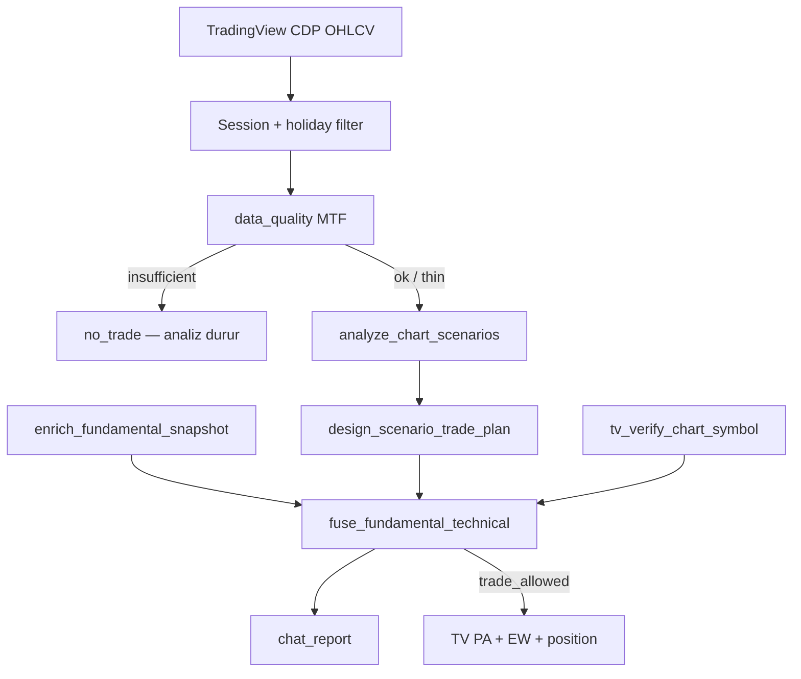

# Analiz pipeline — tutarlılık ve doğruluk

Bu belge, **kural tabanlı** teknik analizin ve **fusion** katmanının nasıl çalıştığını açıklar. Model dalga veya fiyat uydurmaz; tüm sayılar OHLCV ve kaynak API’lerinden gelir.

## 1. Tek giriş: `run_market_assistant`



### Sıra (deterministik)

1. `tv_fetch_mtf_ohlcv` — sembol, HTF/LTF barları (`market_profiles` varsayılanları)
2. `apply_eod_htf_fallback` — HTF zayıfsa Yahoo EOD (yalnızca BIST hisse)
3. `analyze_market_context` — **bir kez** tam TA paketi (`scenario_pack` için saklanır)
4. `enrich_fundamental_snapshot` — KAP, snapshot, funding/OI, sektör, VIOP TS, makro (opsiyonel)
5. `design_scenario_trade_plan` — aynı `scenario_pack` ile **TA tekrar hesaplanmaz**
6. `fuse_fundamental_technical` — nihai `trade_allowed`
7. `build_chat_trade_report` — `sections` + `report_tr`

## 2. Veri kalitesi (`data_quality`)

| Bayrak | Analiz çalışır? | `confidence.trade_recommended` | Fusion |
|--------|-----------------|--------------------------------|--------|
| `ok` | Evet | Normal | Normal |
| `thin` | Evet (uyarı) | Genelde **hayır** (`ok=false`) | `fusion_score` −5, uyarı |
| `insufficient` | **Hayır** — erken çıkış | — | — |
| `stale` | Evet (nadir) | Düşük | Uyarı |

**Tutarlılık kuralı:** Yalnızca `insufficient` teknik pipeline’ı durdurur. `thin` = “analiz var, işlem kapısı sıkı”.

BIST intraday: `filter_session_bars` (10:00–18:00 Istanbul) + `filter_holiday_bars` (statik tatil listesi).

## 3. Teknik katman (`analyze_chart_scenarios`)

### 3.1 MTF Price Action

- HTF yapı + LTF yapı → `aligned_direction`, `trade_quality` (`a_plus` … `conflict`)
- Range kutusu, FVG/IFVG (displacement filtresi), S/R, liquidity sweep
- `recommended_setup`: entry, stop, targets, confluence skoru
- `min_pa_confluence`, `max_entry_chase_atr` — profil bazlı (`market_profiles`)

### 3.2 Elliott (senaryo — overlay, sert kapı değil)

- HTF birincil + LTF sayım → `elliott_mtf`
- **Elliott artık PA'yı bloklamaz.** Senaryo öncelik sırası:
  1. `continuation_aligned` — PA yönü + onaylı EW sayımı (`ew_score >= min_ew_score`) aynı yöne işaret ediyor (en güçlü)
  2. `pa_aligned` — **PA-öncelikli yol**: MTF kalitesi (`a_plus`/`a`/`b`) + PA setup varsa, EW zayıf/yoksa bile `consider_trade`. EW yalnızca overlay (çizim + bonus)
  3. `pa_ew_conflict` / `no_setup` — gerçek çelişki veya kurulum yok
- Impulse kuralları (`rules_passed`/`rules_total`) ve HTF/LTF EW çelişkisi: EW-temelli primary'lerde **sert blok**; `pa_aligned`'da yalnızca **uyarı** (güven skoruna küçük etki)
- `pa_aligned`'da güven skoru yeniden ağırlıklandırılır (PA + MTF ağır basar, EW hafifler) — temiz bir yapısal trend, gürültülü otomatik dalga sayımı yüzünden cezalanmaz

### 3.3 `trade_candidate` (teknik)

Tümü gerekli (özet):

- `primary_scenario.action == consider_trade`
- Yön `long` veya `short`
- MTF `conflict` yok, `trade_quality` ∈ {`a_plus`, `a`, `b`}
- `recommended_setup` dolu
- `elliott_mtf.conflict` yok
- `analysis_confidence.score >= 58` ve `data_quality.ok == true`

### 3.4 `approved` (plan)

`design_scenario_trade_plan`: `trade_candidate` + risk/RR/playbook kuralları + pozisyon boyutu.

## 4. Temel katman (`enrich_fundamental_snapshot`)

| Varlık | Canlı veri |
|--------|------------|
| BIST hisse | KAP, snapshot, sektör RS (eşleşen ticker), TÜRİB (gıda seti) |
| Kripto | Funding %, open interest |
| VIOP | Term structure (vadeli listesi) |
| Makro | `macro_overlay` — yalnızca `TCMB_EVDS_API_KEY` varsa |

`fundamental_score`: −100…+100 heuristik (KAP tonu, funding, sektör RS, makro spread).

## 5. Fusion (`fuse_fundamental_technical`)

```text
fusion_raw = technical_score × 0.72 + (fundamental_score + 50) × 0.28
```

**Bloklayıcı uyarılar (örnek):**

- `crowded_long_funding` — long + funding ≥ 0.025%
- `mtf_conflict`, `elliott_htf_ltf_conflict`
- `tv_symbol_mismatch`

**`trade_allowed`:** teknik `approved` + `trade_candidate` + `fusion_score >= 52` + yukarıdaki sert bloklar yok.

**Tutarlılık:** Grafikte Long/Short kutusu yalnızca `fusion.trade_allowed` iken çizilir (teknik onay yetmez).

## 6. Chat çıktısı (`chat_report`)

| Alan | Amaç |
|------|------|
| `sections.summary_tr` | Tek satır başlık |
| `sections.technical_tr` | MTF, senaryo, EW notu |
| `sections.fundamental_tr` | Canlı highlight + checklist |
| `sections.fusion_tr` | Skor + uyarılar |
| `sections.execution` | `approved`, `technical_approved`, `fusion_block_reason` |
| `report_tr` | Tam metin (LLM için) |
| `trade_allowed` | Nihai işlem izni |

LLM kuralı: `ai_presentation_rules_tr` — sayı uydurma yok.

## 7. Profil tutarlılığı (`get_market_profile`)

Aynı sembol → aynı varsayılan HTF/LTF, `min_ew_score`, `min_pa_confluence`, `ohlcv_bars`.

Örnek:

| Piyasa | HTF → LTF | `ohlcv_bars` |
|--------|-----------|--------------|
| Crypto | 4H → 1H | 300 |
| BIST hisse | D → 1H | 200 |
| VIOP | 4H → 15m | 200 |

## 8. Offline alternatif (TV olmadan tam derinlik)

TV yokken: `get_bist_eod_ohlcv` veya eldeki OHLCV → `analyze_market_context`.

**`fetch_fundamentals=true`** ile offline yol artık online asistanla aynı derinliği verir (grafik çizimi hariç):

- Canlı temel: equity oranları (F/K, PD/DD, ROE, marj, borç, büyüme), KAP tonu, funding/OI, sektör RS, makro
- `fundamental_score` + **fusion kapısı** (`fusion.trade_allowed`, `summary_tr`) çıktıya eklenir
- Ağ/parse hatası TA çıktısını bozmaz → `fundamental_error` alanı döner, analiz devam eder

Tam plan + boyutlandırma için ayrıca `design_scenario_trade_plan` çağrılabilir.

## 9. Sınırlar (dürüst kapsam)

- Broker emri / otomatik işlem yok
- Intraday tick, L2 yok
- TÜRİB scraper düşük güven — fusion’da zorunlu değil
- Elliott otomatik sayım; insan onayı önerilir

*Yatırım tavsiyesi değildir.*
