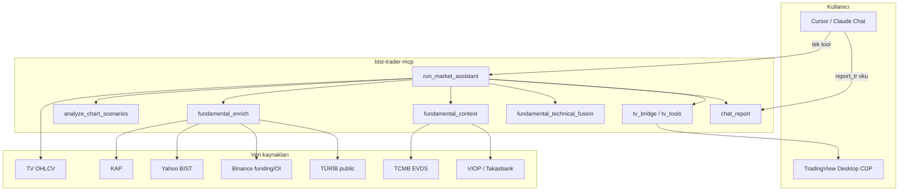
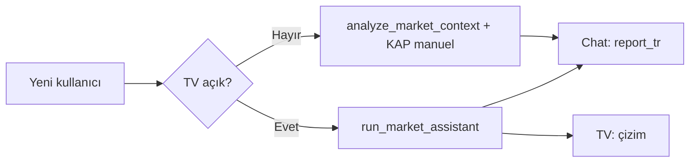

# Master plan — Temel + Teknik Trade Assistant (v1)

> **Uygulama durumu (2026-06):** Faz 0–3 kodlandı (fusion, enrich, session/holiday, EOD HTF, FVG zone, CI, v0.4.0).  
> Operasyonel dokümantasyon: [ANALYSIS_PIPELINE.md](ANALYSIS_PIPELINE.md), [PERFORMANCE_AND_CONSISTENCY.md](PERFORMANCE_AND_CONSISTENCY.md), [TRADE_ASSISTANT.md](TRADE_ASSISTANT.md).  
> Faz 4 (PyPI, `report_en`, demo video) açık.

Bu belge, `bist-trader-mcp` projesinin **tek hedefe** odaklanmış yol haritasıdır:  
Kullanıcı (ve üstündeki yapay zeka) **tek akışla** hem **temel** hem **teknik** analiz alsın; sonuç **chat’te okunabilir**, **TradingView’da görsel** olsun; model **az token, az hata, az uydurma** ile çalışsın.

> Yatırım tavsiyesi değildir. Sistem bir **araştırma ve senaryo asistanı**dır, broker veya sinyal servisi değil.

---

## 1. Hedef durum (North Star)

| Kullanıcı sorusu | Sistem cevabı |
|------------------|---------------|
| “ASELS’e bak” | 1 MCP çağrısı → TR özet + işlem senaryosu + TV çizimi |
| “Neden işlem yok?” | Kapılardan hangisinin düştüğü (EW, güven, funding, KAP çelişkisi) |
| “Temel ne diyor?” | Canlı KAP + sektör + makro ipucu (uydurma yok) |
| “Grafiğe işle” | PA + FVG + EW + (onaylıysa) position kutusu |

**Başarı kriterleri (v1 “mükemmel” sayılır):**

1. **Tek giriş:** `run_market_assistant(symbol)` — %90 kullanım senaryosu.
2. **Chat:** `chat_report.report_tr` + `ai_presentation_rules_tr` — model ek araç çağırmadan özetleyebilir.
3. **Temel:** Varlık sınıfına göre otomatik veri (BIST: KAP+snapshot+sektör; kripto: funding+OI; VIOP: term structure ipucu).
4. **Teknik:** PA + range + FVG + EW MTF + güven skoru — kural tabanlı, tekrarlanabilir.
5. **Fusion:** Temel ile teknik **çelişki / destek** skoru (ör. funding crowded + long setup = uyarı).
6. **TV:** Sembol doğrulama, seans filtresi, işlem yokken analiz çizimi, onaylıysa position.
7. **Publish:** Sürüm, CHANGELOG, CI, quickstart güncel, 5 dk demo video veya GIF.

---

## 2. Mimari (katmanlar)



### 2.1 Veri katmanı (Data plane)

| Varlık | Birincil OHLCV | Temel (otomatik) | Temel (isteğe bağlı derin) |
|--------|----------------|------------------|----------------------------|
| BIST hisse | TV MTF + seans filtresi | KAP (materyal), snapshot | sektör rotasyonu, MKK, EVDS, TÜRİB (gıda) |
| BIST endeks | TV / EOD | snapshot, makro checklist | XU100 breadth |
| Kripto | TV / Binance klines | funding, OI | F&G, Deribit IV |
| VIOP | TV front contract | term structure ipucu | dashboard, settlement |

**Prensip:** `run_market_assistant` içinde **paralel/async** temel çekimi; teknik OHLCV hazır olunca fusion.

### 2.2 Teknik motor (Technical engine) — mevcut + sıkılaştırma

| Modül | Rol | v1 iyileştirme |
|-------|-----|----------------|
| `session_filter` | BIST intraday temizliği | BIST tatil takvimi |
| `data_quality` | thin vs insufficient | stale bar tespiti |
| `price_action` + `mtf_analysis` | Yapı, setup, confluence | HTF EOD yedek (TV bozuksa) |
| `pa_imbalances` | FVG displacement | TV’de zone kutusu |
| `elliott_wave` + `elliott_mtf` | HTF/LTF uyum | LTF EW sadece işlem adayında zorunlu |
| `analysis_confidence` | 0–100 + grade | Fusion sonrası yeniden skor |
| `chart_scenarios` | Senaryo + trade_candidate | Fusion gate entegrasyonu |

### 2.3 Temel motor (Fundamental engine) — genişletme

| Modül | Rol | v1 iyileştirme |
|-------|-----|----------------|
| `fundamental_context` | Checklist + tool listesi | Sektör→tool haritası (banka, gıda, enerji) |
| `fundamental_enrich` | Canlı snapshot | VIOP underlying, `get_bist_sector_rotation` özeti |
| **`fundamental_score`** (yeni) | -1..+1 bias + etiketler | KAP tonu, funding, sektör RS |
| **`macro_overlay`** (yeni) | Opsiyonel EVDS/repo | Sadece `TCMB_EVDS_API_KEY` varsa |

### 2.4 Fusion katmanı (yeni — kritik)

**Amaç:** Yapay zekanın “kendi kafasından” birleştirmesini azalt; birleşik karar **kodda**.

```text
fundamental_technical_fusion(
  technical: trade_candidate, direction, confidence,
  fundamental: highlights, fundamental_score,
) → {
  aligned: bool,
  warnings: ["crowded_long_funding", "kap_material_bearish", ...],
  fusion_score: 0-100,
  trade_allowed: bool,  # technical AND fusion gates
  summary_tr: "..."
}
```

Örnek kurallar (v1):

| Koşul | Sonuç |
|-------|--------|
| Teknik long + funding son 8h çok pozitif | `trade_allowed=false` veya grade düşür |
| Teknik short + sektör top-3 güç | uyarı, grade düşür |
| KAP son 48h materyal negatif + long | uyarı |
| Teknik conflict | zaten no trade |
| Fusion_score < 50 | chat’te işlem önerme, TV’de pozisyon çizme |

### 2.5 Yapay zeka arayüzü (AI plane) — verimlilik

**Problem:** 60+ tool + büyük JSON → model kaybolur, uydurur, fazla çağrı yapar.

**Çözüm:**

| Prensip | Uygulama |
|---------|----------|
| **One-shot default** | Kullanıcıya “şunu çağır” de: `run_market_assistant` |
| **Compact contract** | `chat_report` max ~2 KB metin; ham OHLCV chat’e gitmesin |
| **Structured + prose** | `report_tr` insan okur; `execution` machine-readable |
| **remaining_mcp_tools** | Sadece eksik kalan 2–3 tool adı |
| **MCP Prompt** | `trade-assistant` prompt → tek komut şablonu |
| **Cursor rule** | Repo `.cursor/rules` veya kullanıcı rule: önce RMA, uydurma yok |
| **Resources** | `bist-trader://assistant/workflow` JSON (opsiyonel) |

**Chat akışı (ideal):**

```text
User: "THYAO analiz et"
Assistant:
  1. run_market_assistant(symbol="THYAO")
  2. Kullanıcıya chat_report.report_tr (Türkçe)
  3. remaining_mcp_tools varsa TEK cümleyle öner
  4. TV açıksa "grafik güncellendi" de
```

**Yasaklar (rule):**

- `analyze_chart_scenarios` + ayrı `get_kap` + ayrı `design_plan` zinciri (RMA varken).
- Ham `htf_closes` listesini kullanıcıya yapıştırma.
- `approved:false` iken entry/stop uydurma.

### 2.6 TradingView çıktısı (Presentation plane)

| Öğe | v1 | v1.1 |
|-----|-----|------|
| PA S/R, range, FVG çizgisi | Var | FVG rectangle |
| EW çizgileri + kanal | Var | — |
| TEMEL banner | Var | 2 satır (KAP + funding) |
| Position kutusu | Onaylıysa | R:R etiketi |
| Sembol doğrulama | Kısmen | `symbol_check` → chat uyarısı |
| Screenshot helper | Script var | RMA sonunda opsiyonel `tv_capture` |

---

## 3. Faz planı

### Faz 0 — Publish hijyeni (3–5 gün)

**Amaç:** Dışarıya “beta ama güvenilir” görünüm.

| # | İş | Çıktı |
|---|-----|--------|
| 0.1 | Sürüm `0.4.0` + `CHANGELOG.md` | Tek doğruluk kaynağı |
| 0.2 | `quickstart.md` güncelle | RMA, 266+ test, browser extra, TV |
| 0.3 | GitHub Actions `pytest` | Badge README |
| 0.4 | README üst banner | Beta + disclaimer + 3 komut |
| 0.5 | Demo: ASELS + BTC ekran görüntüsü | `docs/images/` |

**Kabul:** Yeni kullanıcı 15 dk’da RMA çalıştırır veya neden çalışmadığını anlar.

---

### Faz 1 — Fusion + AI verimliliği (1–2 hafta)

**Amaç:** “Mükemmel” hissinin çoğu burada — tek cevap, tutarlı kapılar.

| # | İş | Dosya / tool |
|---|-----|----------------|
| 1.1 | `fundamental_technical_fusion.py` | Skor + warnings + trade_allowed |
| 1.2 | RMA içinde fusion; `chat_report` fusion satırı | `market_assistant.py`, `chat_report.py` |
| 1.3 | Kripto funding gate (crowded long/short) | fusion rules |
| 1.4 | `fundamental_score` basit heuristik | KAP + sektör RS + funding |
| 1.5 | MCP prompt `trade-assistant` | `server.py` PROMPTS_REGISTRY |
| 1.6 | `.cursor/rules/trade-assistant.mdc` (örnek) | Repo |
| 1.7 | `chat_report` v2: `sections` + `fusion` | LLM için sabit şema |
| 1.8 | Test: fusion + chat_report | `tests/` |

**Kabul:** Funding aşırı + long setup → `trade_allowed=false` ve raporda açık Türkçe sebep.

---

### Faz 2 — Temel derinleştirme (1–2 hafta)

| # | İş | Not |
|---|-----|-----|
| 2.1 | Sektör rotasyonu otomatik (BIST) | `get_bist_sector_rotation` enrich içinde |
| 2.2 | VIOP: underlying için term structure snapshot | enrich |
| 2.3 | `macro_overlay` (EVDS key varsa) | repo spread, TLREF — kısa metin |
| 2.4 | TÜRİB: sektör eşlemesi genişlet | gıda/kimya ticker set |
| 2.5 | `get_news_headlines` opsiyonel 3 başlık | sadece fusion uyarısı |

**Kabul:** BIST hisse raporunda en az 3 canlı temel satır (KAP + fiyat + sektör veya makro).

---

### Faz 3 — Teknik + TV cilası (1–2 hafta)

| # | İş | Not |
|---|-----|-----|
| 3.1 | TV sembol mismatch → fusion/chat uyarısı | `symbol_check` |
| 3.2 | FVG zone TV rectangle | `tv_bridge` |
| 3.3 | BIST tatil / yarım gün filtresi | `session_filter` + JSON takvim |
| 3.4 | HTF yedek: `get_bist_eod_ohlcv` TV thin ise | RMA fallback |
| 3.5 | `run_market_assistant` integration test (mock TV) | CI |
| 3.6 | Watchlist: `scan_ta_fundamental_watchlist` + chat özet | tarama |

**Kabul:** ASELS 1H grafikte seans dışı mumlar analizi bozmaz; FVG zone görünür.

---

### Faz 4 — v1.0 “ürün” (2–3 hafta)

| # | İş | Not |
|---|-----|-----|
| 4.1 | `run_market_assistant` tek resmi entry; diğerleri doc’ta “advanced” | README |
| 4.2 | PyPI / `pip install` smoke | opsiyonel |
| 4.3 | İngilizce `chat_report.report_en` | LinkedIn / global |
| 4.4 | Likidasyon / heatmap harici — yok say veya v2 | scope dışı |
| 4.5 | Alpha Trend confluence — v2 | scope dışı v1 |
| 4.6 | Kullanıcı anketi: 5 beta tester | geri bildirim |

**Kabul:** v1.0 tag; CHANGELOG’da breaking yok; demo video README’de.

---

## 4. Tool yüzeyi stratejisi (AI için)

### Kullanıcıya göster (3 komut)

```text
run_market_assistant(symbol)     # %90 — tam analiz
get_market_profile(symbol)       # profil / TF önerisi
get_trade_playbook_rules()       # kurallar
```

### Gelişmiş / offline (dokümante, chat’te önerilmez)

```text
analyze_market_context(...)      # OHLCV elinde
design_scenario_trade_plan(...)
run_scenario_assistant(...)      # alias
```

### Veri araçları (RMA içinde otomatik; chat sadece `remaining_mcp_tools`)

KAP, snapshot, funding, OI, TÜRİB, sektör, EVDS, VIOP — **checklist değil, fetch**.

---

## 5. `chat_report` hedef şeması (v2)

```json
{
  "headline_tr": "...",
  "sections": {
    "technical": { "structure", "scenario", "confidence", "ew_mtf" },
    "fundamental": { "highlights", "score", "sources_fetched" },
    "fusion": { "aligned", "warnings", "fusion_score", "trade_allowed" },
    "execution": { "approved", "entry", "stop", "targets", "rr" }
  },
  "report_tr": "tam metin",
  "ai_presentation_rules_tr": "...",
  "remaining_mcp_tools": [],
  "chart_status": "drawn|skipped|tv_off"
}
```

Model yalnızca `report_tr` + gerekirse `sections.fusion.warnings` okur — token tasarrufu.

---

## 6. Riskler ve scope dışı

| Risk | Mitigation |
|------|------------|
| KAP/Playwright kırılır | Graceful degrade; checklist + hata mesajı |
| TV CDP kapalı | RMA chat-only mod; `draw_on_chart=false` |
| Model uydurma | fusion + rules + compact report |
| TÜRİB lisans | Sadece public özet; ticari feed yok |
| EVDS key yok | macro_overlay atlanır |

**v1 scope dışı:** Otomatik emir, garantili edge, Alpha Trend/PMax, tam TÜRİB lisanslı feed, mobil app.

---

## 7. Ölçülebilir metrikler

| Metrik | Hedef v1 |
|--------|----------|
| pytest | ≥ 280, CI green |
| RMA latency (BIST, cache warm) | < 45 sn (KAP+TV) |
| Chat token (rapor) | < 2500 token/çağrı |
| false trade_candidate | kullanıcı geri bildirimi < %10 |
| TV chart success | > %90 (CDP açıkken) |

---

## 8. Kullanıcı yolculuğu (3 mod)



| Mod | Komut | Ne alır |
|-----|--------|---------|
| **Tam** | `run_market_assistant` | Chat + TV + temel canlı |
| **Chat** | `draw_on_chart=false` | Sadece rapor |
| **Offline** | `analyze_market_context` + OHLCV | Teknik + checklist |

---

## 9. Hemen başlanacak sıra (özet)

1. **Faz 0** — publish hijyeni (sürüm, CI, quickstart).  
2. **Faz 1** — `fundamental_technical_fusion` + chat_report v2 + Cursor prompt/rule.  
3. **Faz 2** — temel enrich genişletme (sektör, VIOP, macro).  
4. **Faz 3** — TV cilası + test.  
5. **Faz 4** — v1.0 tag + beta kullanıcı.

---

## 10. İlgili belgeler

- [`TRADE_ASSISTANT.md`](TRADE_ASSISTANT.md) — mevcut kullanım  
- [`TURIB_AND_TV_ANALYSIS.md`](TURIB_AND_TV_ANALYSIS.md) — TV/TÜRİB boşlukları  
- [`PA_CHECKLIST_TR.md`](PA_CHECKLIST_TR.md) — teknik kontrol listesi  
- [`LINKEDIN_POST.md`](LINKEDIN_POST.md) — dış anlatım  

**Sonraki kod adımı (öneri):** Faz 1.1 — `fundamental_technical_fusion.py` + RMA entegrasyonu.
